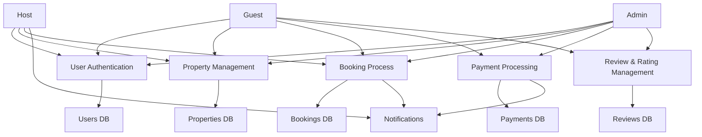

# 📊 Data Flow Diagram (DFD)

## 🎯 Objective

The objective of this task is to **visualize the flow of data** within the Airbnb Clone backend using a **Data Flow Diagram (DFD)**.
This diagram helps understand how data moves between **users, system processes, and data stores** for key operations such as user registration, property management, bookings, payments, and reviews.

---

## 🧠 Description

The DFD illustrates:

* **Data Sources / Inputs:** Guest, Host, Admin interactions
* **Processes:** User authentication, property listing, booking creation, payment processing, review management
* **Data Stores:** Users, Properties, Bookings, Payments, Reviews
* **Outputs / Responses:** Confirmation messages, notifications, reports

This diagram serves as a blueprint for **API design, database interaction, and system logic**.

---

## 🗺️ Mermaid Data Flow Diagram

---

## ⚙️ Tools & Repository Structure

| Item           | Description                                                      |
| -------------- | ---------------------------------------------------------------- |
| **Tool**       | Mermaid.js (DFD rendering in Markdown)                           |
| **Repository** | `alx-airbnb-project-documentation`                               |
| **Directory**  | `data-flow-diagram/`                                             |
| **File**       | `data-flow.png` (exported from Mermaid or Draw.io for reference) |

---

## ✅ Summary

This DFD provides a **high-level visualization** of how data moves within the Airbnb Clone backend.
It ensures clarity for **backend logic, database interactions, and API workflows** for all system actors.
