# 🔄 Backend Process Flowchart

## 🎯 Objective

The objective of this task is to **map the workflow and processes** of a key backend feature within the Airbnb Clone backend.
This helps visualize the **sequence of steps, decision points, and data flow** for core operations such as **user registration** or **property booking**.

---

## 🧠 Description

Flowcharts provide a **step-by-step representation** of a process, showing:

* **Inputs:** Data or actions from users or other systems
* **Processing Steps:** Backend logic, validations, or automated actions
* **Decision Points:** Conditional branches (e.g., booking availability check)
* **Outputs:** Responses, confirmations, or updates to databases

For this example, we have mapped the **User Registration Process**.

---

## 🗺️ Example Flow

1. User submits registration form
2. System validates input data

   * If invalid → return error
   * If valid → continue
3. System creates a new user record in the **Users DB**
4. System sends a confirmation email to the user
5. User account is activated and ready to use

> The flowchart visually represents these steps, including validations and notifications.

---

```mermaid
%% User Registration Flowchart
flowchart TD
    subgraph "User Registration Process"
        UR1[User submits registration form] --> UR2[Validate input data]
        UR2 -->|Invalid data| UR3[Return error to user]
        UR2 -->|Valid data| UR4[Create user record in Users DB]
        UR4 --> UR5[Send confirmation email]
        UR5 --> UR6[Activate user account]
        UR6 --> UR7[User can log in and access features]
    end

%% Property Booking Flowchart
    subgraph "Property Booking Process"
        PB1[Guest selects property and dates] --> PB2[Check availability]
        PB2 -->|Not available| PB3[Show error message]
        PB2 -->|Available| PB4[Create booking record in Bookings DB]
        PB4 --> PB5[Calculate total price]
        PB5 --> PB6[Process payment]
        PB6 -->|Payment failed| PB7[Notify guest and cancel booking]
        PB6 -->|Payment successful| PB8[Confirm booking]
        PB8 --> PB9[Send confirmation notifications to Guest and Host]
    end
```

## ⚙️ Tools & Repository Structure

| Item           | Description                                   |
| -------------- | --------------------------------------------- |
| **Tool**       | Mermaid for flowchart creation |
| **Repository** | `alx-airbnb-project-documentation`            |
| **Directory**  | `flowcharts/`                                 |
| **File**       | `data-flow-diagram.png`                       |

---

## ✅ Summary

This flowchart provides a **clear visual guide** of backend processes, helping developers understand the workflow and data handling for critical features.
It also serves as a reference for **API design, testing, and documentation**.
