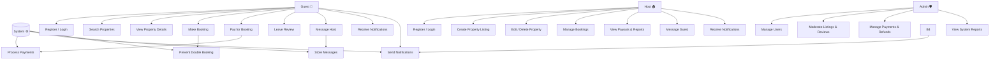

# Use Case Diagram (Mermaid)

```mermaid
flowchart TD
    %% Define actors
    A[Guest 👤]
    B[Host 🏠]
    C[Admin 🛡️]
    S[(System ⚙️)]

    %% Guest actions
    A --> G1[Register / Login]
    A --> G2[Search Properties]
    A --> G3[View Property Details]
    A --> G4[Make Booking]
    A --> G5[Pay for Booking]
    A --> G6[Leave Review]
    A --> G7[Message Host]
    A --> G8[Receive Notifications]

    %% Host actions
    B --> H1[Register / Login]
    B --> H2[Create Property Listing]
    B --> H3[Edit / Delete Property]
    B --> H4[Manage Bookings]
    B --> H5[View Payouts & Reports]
    B --> H6[Message Guest]
    B --> H7[Receive Notifications]

    %% Admin actions
    C --> AD1[Manage Users]
    C --> AD2[Moderate Listings & Reviews]
    C --> AD3[Manage Payments & Refunds]
    C --> AD4[View System Reports]

    %% System processes
    S --> P1[Process Payments]
    S --> P2[Send Notifications]
    S --> P3[Store Messages]
    S --> P4[Prevent Double Booking]

    %% Associations between actions and system processes
    G4 --> P4
    G5 --> P1
    G7 --> P3
    B4 --> P2
    A --> P2
```
